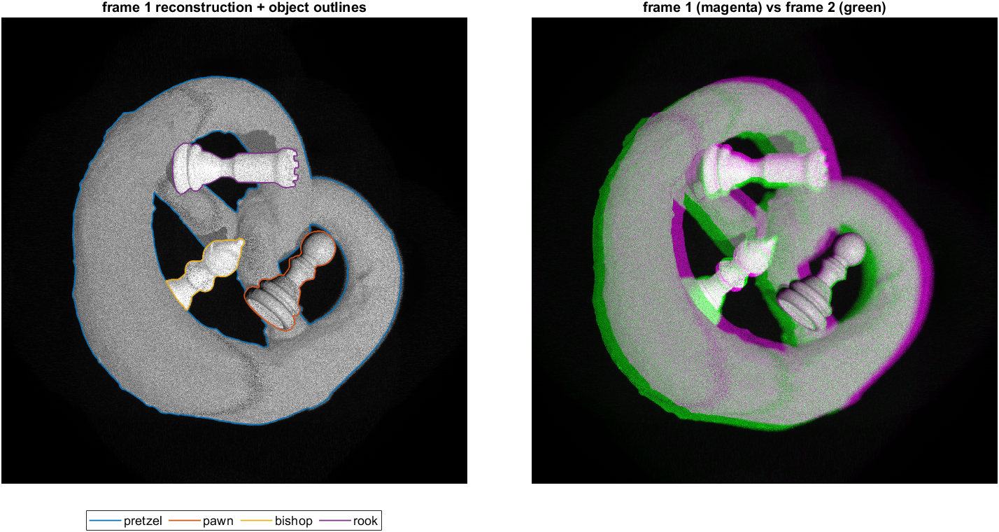

# CCAF motion estimation — `scene_1` demo

Direct rigid-motion estimation for digital holography with the **Chirped Cross-Ambiguity
Function (CCAF)**. From two hologram frames the estimator recovers, per space-frequency
crop, five rigid-motion parameters — lateral translation `(tx, ty)`, depth `tz`, and
rotation `(θx, θy)` — without tracking or feature correspondence.

This repository is a minimal, self-contained demo on one synthetic scene (`scene_1`):
a pretzel-shaped knot wrapping three chess pieces (pawn, bishop, rook), each undergoing
an independent rigid motion between two hologram frames, with mutual occlusion. The
rotations range from 0.2° to 1° per axis.



## Requirements

- **MATLAB** R2019b or newer (uses only base MATLAB — no extra toolboxes required).
- *Optional:* **Parallel Computing Toolbox** + a CUDA GPU. The demo uses the GPU
  automatically when present and falls back to the CPU otherwise (same math, just slower).
- **[Git LFS](https://git-lfs.com)** to download the data: each hologram frame is ~77 MB.

## Getting it

```bash
git lfs install
git clone https://github.com/Bilalovski/ccaf-scene1-demo.git
```

If you cloned without Git LFS, the `.mat` files are small text pointers: run `git lfs pull`
inside the repo to fetch the real data (the demo detects a pointer and tells you).

## Contents

```
scene1_single.m           the demo: CCAF on ONE space-frequency crop that you click
lib/
  ccaf_2D_fast_twostage_refined.m   the CCAF estimator (GPU/CPU)
  ang_spectrum.m                    angular-spectrum reconstruction
  load_scene1_pair.m                loads the two frames + the ground truth
data/
  scene1_meta.mat         pitch, wavelength, distance, ground truth, object maps (Git LFS)
  scene1_frame01.mat      hologram, frame 1 (Git LFS)
  scene1_frame02.mat      hologram, frame 2 (Git LFS)
docs/
  scene1.png              the picture above
```

## Running the demo (seconds on a GPU, up to ~2 min on a CPU)

```matlab
scene1_single
```

It reconstructs both frames and shows frame 1: **click the centre of the crop you want**
(the `M×M` window is kept inside the field). With `K < M` a second window shows that crop's
spectrum: **click the centre of the frequency band** (DC is marked). The CCAF runs on the
GPU if there is one, otherwise on the CPU. It prints a table with the true motion of every
object and the CCAF estimate for your crop underneath. It also shows the response landscape
with every object's true rotation marked, so you can check by eye which object your crop
locked onto.

## Parameters

The `PARAMETERS` block at the top of `scene1_single.m` holds the crop sizes `M`, `K` and the
search grid `THETA` (deg) and `TZ` (m). Estimates are reported with rotations in **degrees**,
`tx`/`ty` in **pixels** (`1 px = pp = 6 µm`) and `tz` in **mm**.
Axes: **rows = x, columns = y** (`θx`/`tx` act along rows, `θy`/`ty` along columns).

**Choosing `M` and `K`.**

- `M` (spatial crop, even): `M/2` must exceed the translation, because the CCAF finds shifts
  in `[−M/2, M/2)`. The pretzel's `|ty| = 100` px needs `M ≥ 256`. `M` must also be smaller
  than the object you crop, so the crop holds a single motion.
- `K` (frequency crop, even, `K ≤ M`; `K = M` keeps the whole spectrum): a tilt `θ` shifts
  the crop's spectrum by `M·pp·sin(θ)/λ` bins (≈ 5 bins per 0.1° at `M = 256`). The band
  must still overlap between the two frames, so `K/2 ≥ M·pp·sin(θ)/λ`. The pretzel's 1°
  needs `K ≥ 101` at `M = 256`: `K = 128` reaches 1.27°, `K = 64` only 0.63°.
  At `K = M` the limit is the sampling limit `asin(λ/2pp) = 2.54°`, far above every
  rotation here. The demo prints the shift and tilt limits of your `M` and `K`.

## The data

`data/scene1_meta.mat`:

| field | meaning |
|-------|---------|
| `pp` | pixel pitch (m) — 6 µm |
| `lambda` | wavelength (m) — 532 nm |
| `z_obj` | object-plane distance (m); reconstruct with `ang_spectrum(H, pp, -z_obj, lambda)` |
| `N`, `n_frames` | field size (4096), number of frames (2) |
| `gt` | ground truth: `names`, the motion `step_*`, and the exact motion between any two frames `pair_*(a, b, object)` |
| `label`, `label_ds` | object map of each frame (`N/label_ds` square, `0` = background, `j` = `gt.names{j}`) |

`data/scene1_frame01.mat`, `data/scene1_frame02.mat`: `H`, the complex field of that frame at
the **hologram plane** (4096×4096, `single`).

`lib/load_scene1_pair.m` hides all of this: `[H, G, S] = load_scene1_pair('data', 1, 2)`
returns the two frames and, in `S.gt`, the motion from the first to the second (one value per
object, in `S.names` order).

### Ground-truth motion (frame 1 → frame 2)

| object | θx (°) | θy (°) | tx (px) | ty (px) | tz (mm) |
|--------|-------:|-------:|--------:|--------:|--------:|
| pretzel | +1.00 | −1.00 | +50 | −100 | +1 |
| pawn    | +0.20 | −0.30 | +10 | +15  | −1 |
| bishop  | −0.25 | +0.35 | −30 | +30  |  0 |
| rook    | +0.30 | +0.20 | +40 | −20  | −2 |

Rotations are about the pivot `(0, 0, z_obj)`, followed by the translation. `tx`, `ty`, `tz`
are defined at the pivot. A surface point at depth `z` and lateral position `(x, y)` moves
in addition by the rotation itself: approximately `−(z − z_obj)·θx` in x, `+(z − z_obj)·θy`
in y and `x·θx − y·θy` in depth (θ in radians). The visible surface spans
`z = 43.4–50.6 mm` around `z_obj = 45.96 mm` (`z − z_obj` from −2.6 to +4.7 mm). For the
pretzel's 1° that adds up to ~14 px, so a crop's local translation can differ from the table
by that much. The rotation is the same everywhere on an object.

## Credits

The synthetic scene was built from two Creative Commons models:

- **"Pretzel"** by **Convex CGI** — <https://sketchfab.com/3d-models/pretzel-6e9a5edb16bf41f28c5dcf42865e5837>
- **"Chess set"** by **Brendan Wood** — <https://sketchfab.com/3d-models/chess-set-a2664ea4fcaa4a64ad077667d9d0c7fb>

Both licensed under [CC BY 4.0](https://creativecommons.org/licenses/by/4.0/).

## Citation

If you use this code, please cite the accompanying paper *(TODO: add reference once published)*.
